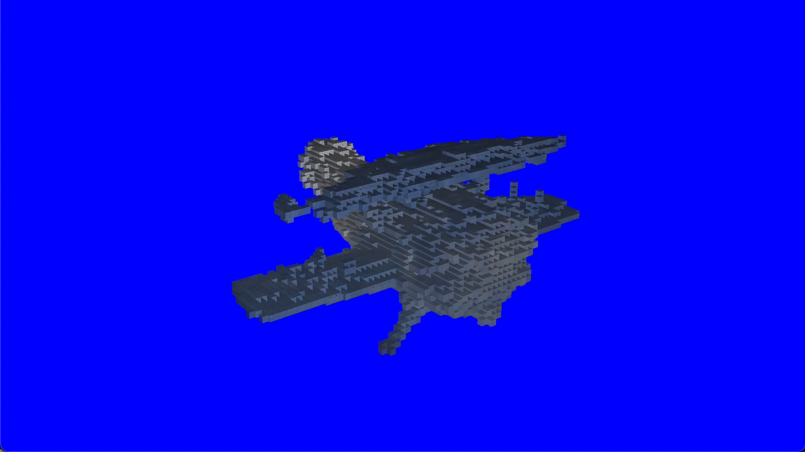
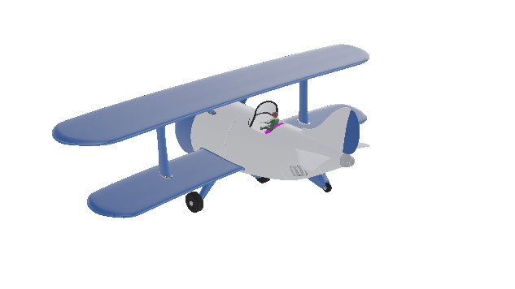
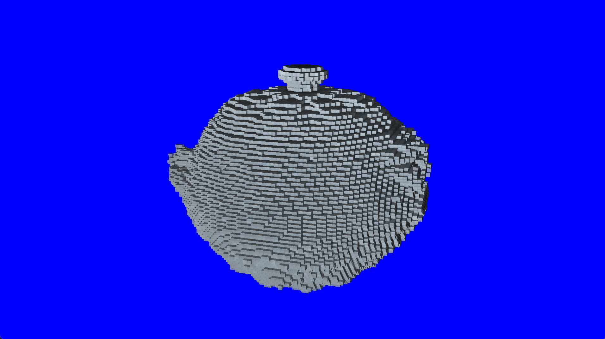
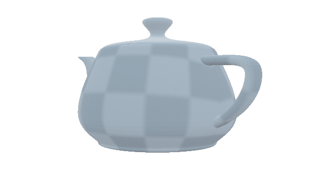
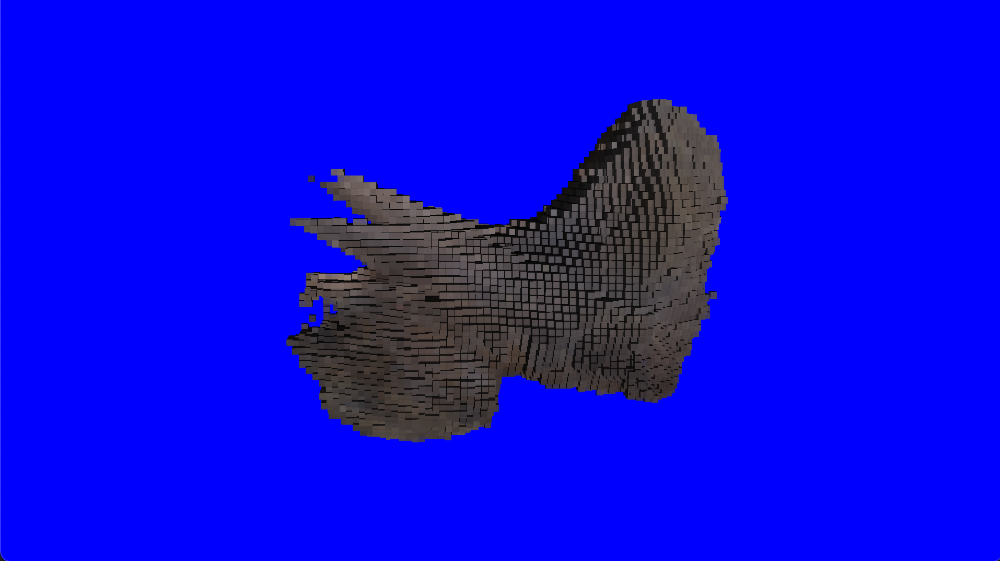
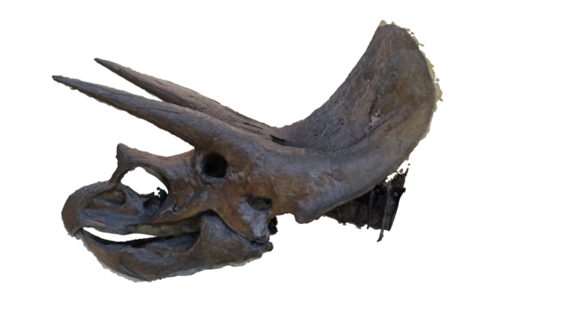
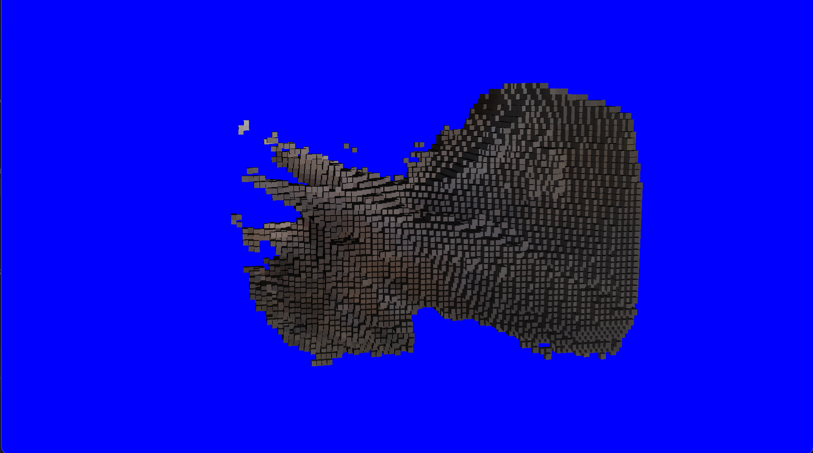
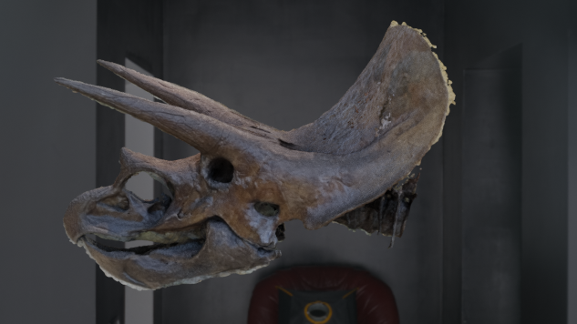

# voxel-carving

## Problem:

The idea of voxel carving is to create a 3D representation of a set of images made out of small cubes
called voxels. For each voxel, I project it on every image and take the standard deviation of colors found this way.
If the standard deviation is within a set threshold, the voxel is set to the average of the colors.

## System Requirements:
To run the code, you must have javafx installed as well as the apache commons math library.

## Usage:
Running the code will create a popup window showing the result of the voxel carving. 
You can rotate by dragging the mouse and zoom by scrolling. 

#### Global Constants
Global constants and hyperparameters are stored in the ```SceneConstants.java``` file. Some notable constants you might wish to adjust are:
- ```SHOW_IMAGES``` - Whether to display the images used to calculate the voxels in the scene
- ```TOLODRANCE``` - The maximum standard deviation of colors for the voxel to be included
- ```RES``` - The number of voxels per row/column/layer of the cube formed by all the voxels (the cube will have in total ROW³ voxels)
- ```SIZE``` - The side length of each voxel
- ```IMAGE_DIST``` - The distance of the images from the center of the sphere they are oriented around


#### Selecting an object to visualize:
By default, there are 4 sets of images to choose from. To change which object is being carved, change the ```DATASET``` constant
in the ```SceneConstants.java``` file. The current options are: 
```plane```, ```teapot```, ```triceratops-alpha```, ans ```triceratops```.

#### Adding other datasets:
You can also add your own sets of images. A blender file is included with settings configured to render
many views of a model at once. You can edit the included models or add new ones. The files outputted must (and are currently configured in the blender file to)
include the angles of the camera in the following form:

```YOURFILENAME_THETA_PHI.XYZ``` (useing commas instead of dots for decimals)

ex: ```teapot_45_22,5.png``` would correspond to an image oriented at &theta; = 45&deg;, &phi; = 22.5&deg;.

The images are assumed to be taken at a fixed focal length in a sphere of radius ```IMAGE_DIST```surrounding the object,
although the code could be easily changed to accomodate more setups.

## Results:

Overall the algorithm created shapes that resemble the original images. However, it has trouble
with smaller details such as the propellers of the airplane or the handle of the teapot. 
Many of these images had transparent backgounds that helped reduce confusion with
background objects. We can see how in the 4th image, the triceratops is not as accurate as pervious image because
the pixels in the background are somewhat similar to the pixels of the desired object.













## Future improvements:

One idea I tried was to use HOG descriptors rather than just the color information of the image. However, this gave very
bad results when I first attempted it so I decided to just use the color data. However, if some other descriptor might work
well that takes color into account rather than just the local texture of the scene and is worth exploring. 

In addition, I did not account for the case when multiple voxels are projected to the same pixel of an image.
This could be achieved by keeping track of which pixels have already been seen in each image and visiting voxels
that are likely to be occluders first.


